Part 1

# The Journey: Write a book

You’ve decided to follow your dream and write a book. You plan for an epic
novelization on the life of the humble cow. It will be grand. It will be
sweeping. It will be moooving.

## Working Directory

Your first step is to create a new folder for your project called MyProject.
All of your files will go in this folder. you'll call this your <em>working
directory</em>. (For the intents and purposes of this tutorial, directory and folder
mean the same thing. They are synonyms.)

<figure>
  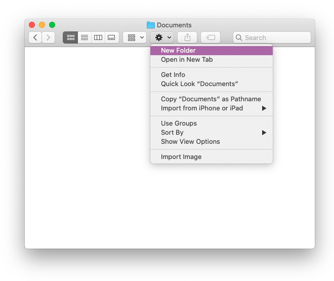
  <figcaption>Create a new folder</figcaption>
</figure>

<figure>
  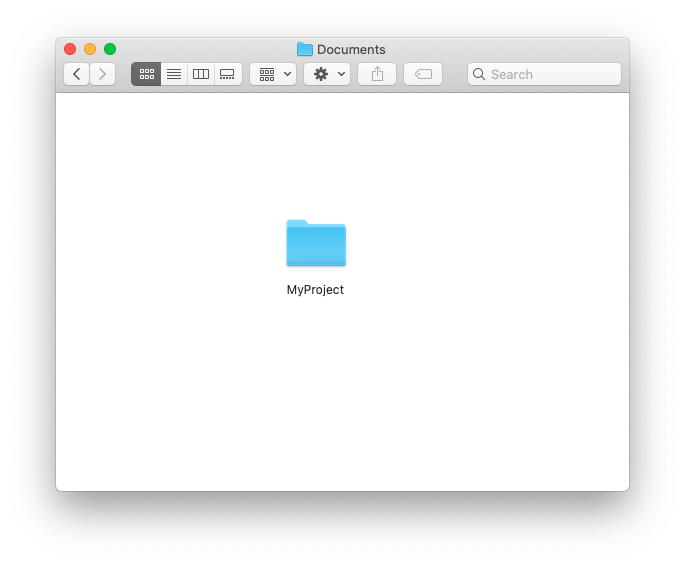
  <figcaption>MyProject folder</figcaption>
</figure>

Use Microsoft Word, VS Code, or any other application you want to create files.
Or copy images, videos, whatever.

<figure>
  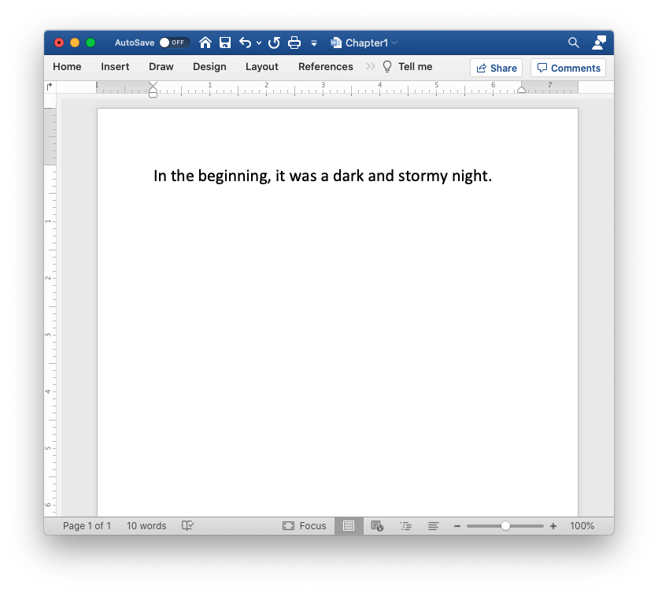
  <figcaption>Word Processor</figcaption>
</figure>

<figure>
  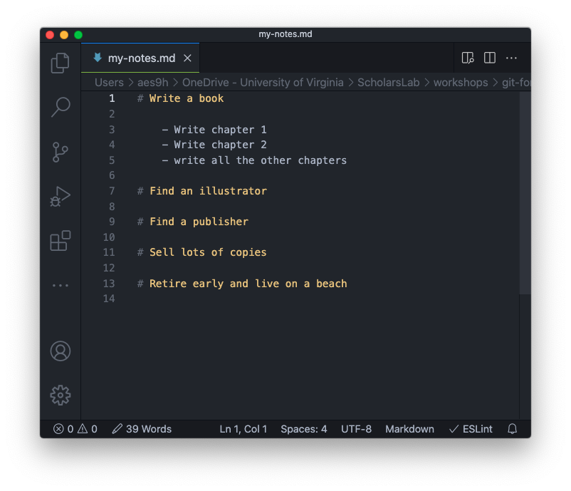
  <figcaption>Code Editor</figcaption>
</figure>

Let’s add a picture of a fluffy bunny. Just for fun. Every good project needs a
fluffy bunny. You’ll work it into the story somehow.

<figure>
  
  <figcaption>Fluffy Bunny</figcaption>
</figure>

So now your folder looks like this:

<figure>
  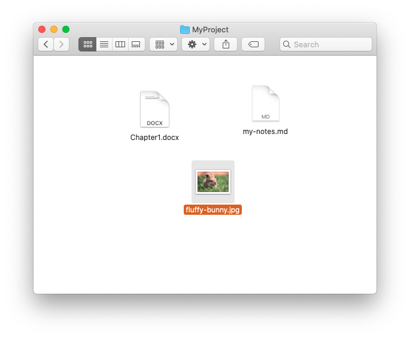
  <figcaption>Folder</figcaption>
</figure>

A few days pass, and you have written quite a bit of chapter 1, but now tragedy
strikes. You realize that you deleted a page worth of text that should really
be in the book. You really wish you had a copy of the document from two days
ago. But there's no time machine, and the program’s undo function doesn’t go
back that far. Even if it did, it would delete everything you wrote after you
deleted the page. You decide to do something going forward.

You reckon that life would be good, and mistakes would be recoverable, if you
just had a snapshot of all your work at the end of each work session. Something
like the “undo” ability of your word processor, but for all of your files. You
imagine a system that would account for any changes in any file, effectively
making a backup or snapshot of your folder at any time you desire. So, being
the inventive and creative type that you are, you are going to do something
about it and take a snapshot of your documents at the end of each day, so this
never happens again.

## Snapshots of the Past

You start by making a <em>snapshots</em> folder where you will put your
snapshots. You'll keep things here so that you don't have a mess of files
cluttering up your main project folder. A snapshot will be a copy of all of the
files in the project folder, or the working directory, at a specific point in
time.

<figure>
  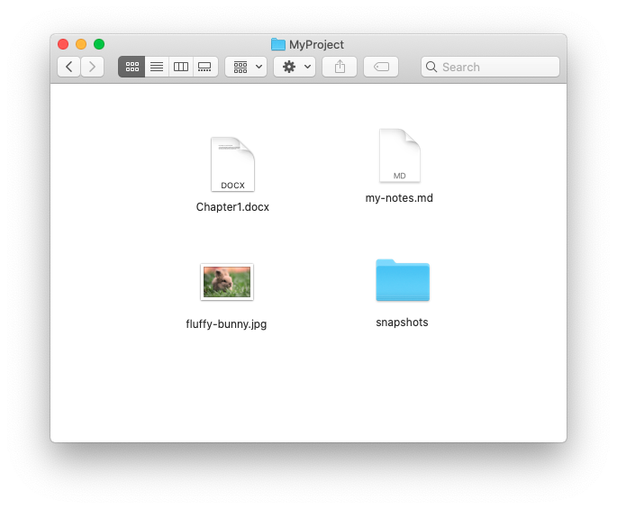
  <figcaption>Snapshot Folder</figcaption>
</figure>

As you do this, you realize, it might be even better to have each snapshot go
into a folder named with the date and timestamp in case you have multiple
snapshots in a day. You decide that each snapshot should contain just a single
change. You can imagine a scenario where you spend all day working on 5
different aspects of the project and commit all of those changes into one
snapshot. Then later, you realize you want to revert just one of those changes.
Since all 5 are in the same snapshot, all 5 changes are reverted, instead of
just the one. So, to avert such an issue, you decide to make each snapshot
contain a single concise change or chunk of work. The snapshot may contain
changes to several files, but they all relate to a single topic or purpose. For
example, you can add a chapter and an illustration to go along with it.

<span class="software"> If you think about coding a software project, a snapshot would be a concise, individual feature, or a bug fix, or even adding a single function and the code to test the function.</span>

Since this is a reflection of what Git does, I’ll just interlude here to say
that a snapshot in Git speak is called a <em>commit</em>; you're committing the
snapshot to the snapshots folder, or as Git calls it, the <em>repository</em>.
A repository acts as the history of your project’s files. It is a record of the
changes, as recorded by you, every time you take a snapshot (or commit) of the
working directory.

<figure>
  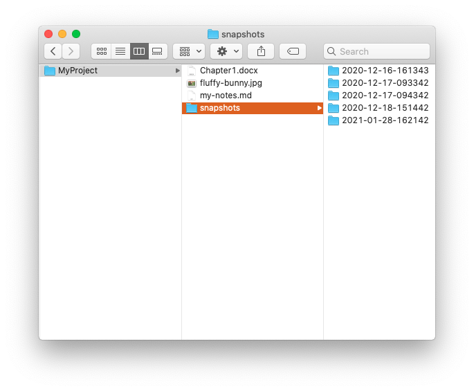
  <figcaption>Snapshot folder with dated sub-folders</figcaption>
</figure>

## Staging Area, the Index

You work like this for a while. Maybe a few days. And the system is working
great. You feel confident each day because you can start working without fear
of losing anything you created in previous days. You have a snapshot of every
change you’ve made.

<figure>
  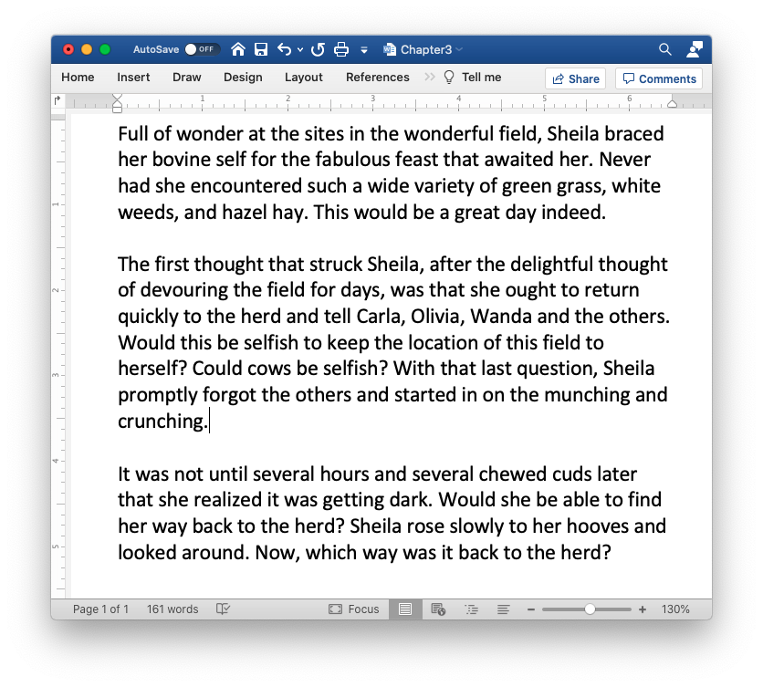
  <figcaption>Chapter 3</figcaption>
</figure>

But today, after working for several hours on chapter 3, you remember something
vital for chapter 1. How can you take a snapshot of the change to chapter 1
without adding all of the incomplete changes to chapter 3?

<figure>
  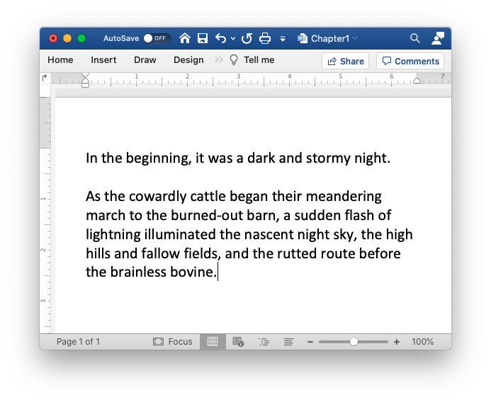
  <figcaption>Chapter 1 changes</figcaption>
</figure>

<span class="software"> If you are a software developer creating a new feature in your software or website, what do you do if you find a bug in the code while working on a new feature? How can you quickly fix the bug, commit the change to fix the bug, but not incorporate the incomplete changes to the feature?</span>

You decide to make a folder in the snapshot directory (so it doesn’t clutter
the working directory) for staging your snapshots. You will add to the staging
folder only the changed files you want in the snapshot. Then you will commit
only those files in the staging area into a new snapshot.

So, first, you make a new folder in the snapshots folder called
<ev>staging</ev>. Git also calls this staging folder the <em>index</em>.

<figure>
  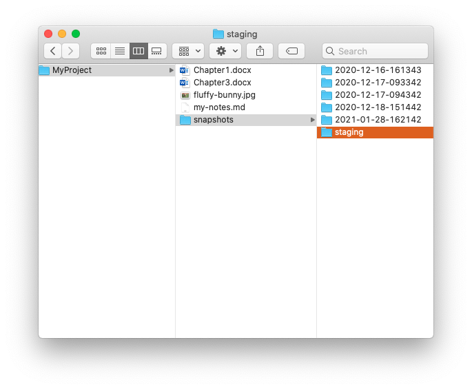
  <figcaption>Staging Folder</figcaption>
</figure>

Now you can add just the changed chapter 1 file to the staging folder, then
make the snapshot of the staging folder. This way, you can keep certain
unwanted changes from cluttering up your snapshots.

<figure>
  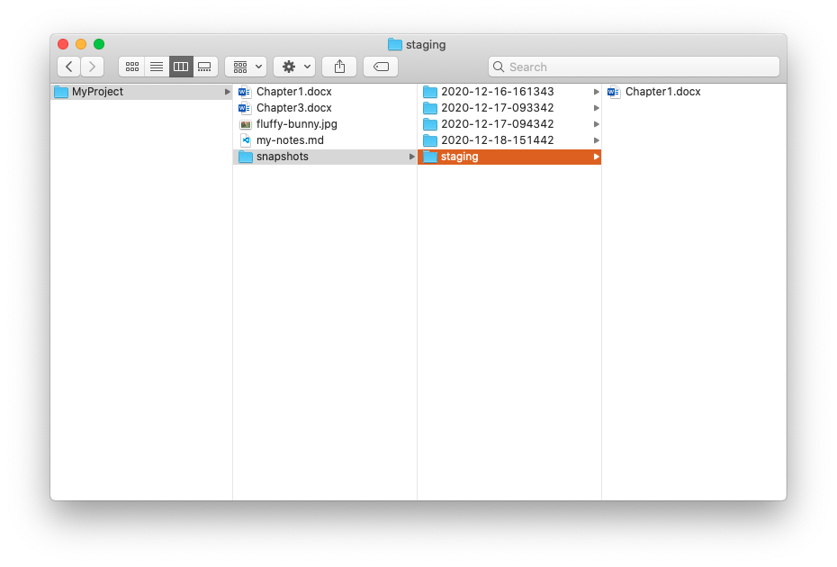
  <figcaption>Staged File</figcaption>
</figure>

<figure>
  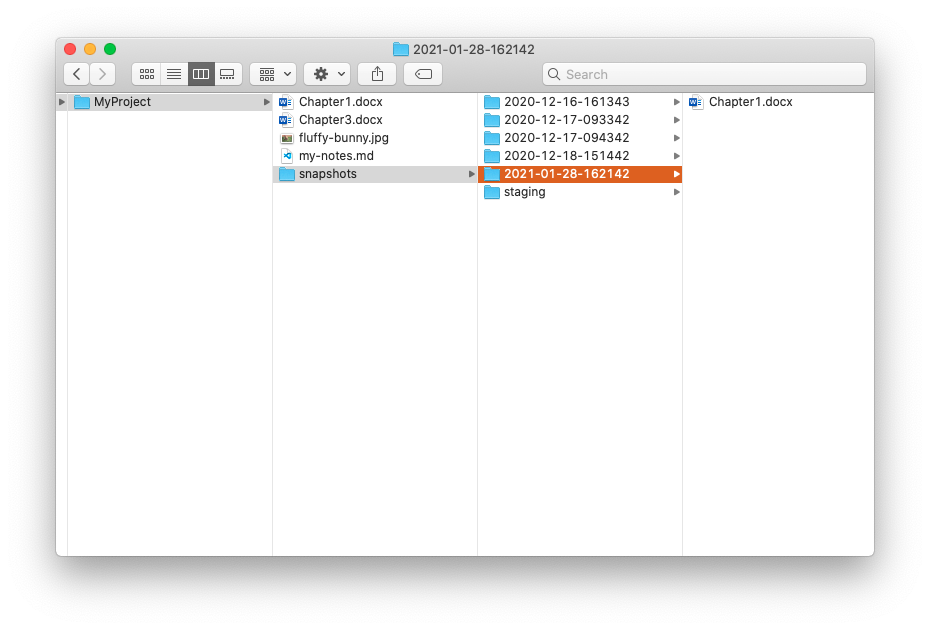
  <figcaption>Staged File to Snapshot Folder</figcaption>
</figure>

But, why would you add the staging folder, when you can just copy the files you
want from the project folder directly into a new snapshot folder? In reality,
it is an unnecessary step for the process you have now, but keep in mind that
you are mimicking the Git software. Using a staging folder will make it much
easier to have software do this step for you at a later time. In the Git
software, the staging folder, or index, points to the latest commit. When you
change files in the working directory, Git can see the differences from the
last commit and the current state of files in the working directory. This is
really handy for showing exactly what has changed in a specific file or
directory.

## Alternative Timelines This process works really great, and you plug along

for days before running into the next issue. As you continue to polish chapter
3, you have a brilliant idea that may or may not work with the current
plot-line you have going with the book. You don’t want to start a new project,
or clutter your current working directory. What can you do?

You take a break from this problem and look over your map of the New York
Subway system as you think of your upcoming trip. This get’s your brain
spinning about a possible solution for your content management problem. The
iconic map of the subway is a series of connected lines that branch off and
reconnect, and there are many dots representing stations on each rail line.

<figure>
  
  <figcaption>New York City Subway Map</figcaption>
</figure>

As you think about it, you realize that one subway line is like a timeline of
your project’s history. Each of the subway stops is like a snapshot. The
different subway lines are like alternate timelines, or branches with different
possible snapshots. Is there a way to branch off of your main project “line”,
make some new files, create some alternative ideas, but come back to the main
line when needed, or even merge the ideas in the alternative lines back into
the main line?

<span class="software"> In writing software, this makes even more sense. If you find a bug in your code, you can take the last snapshot, fix the errors, then put the fixed code as the next commit in the main line.</span>

The current status with your project and the five snapshots you already have
might look something like this:

<figure>
  
  <figcaption>Map of recent commits</figcaption>
</figure>

The blue line represents the “timeline” of your project, and each circle
represents a snapshot, as it goes in chronological order from left to right.

Now you can easily imagine a separate line branching off of the last snapshot
to form a new line. You can then make further edits and snapshots on the new
line, and the main line without mixing the two. But then when everything on the
new line looks good, it can be merged back into the main line.

<figure>
  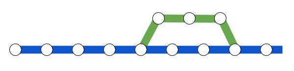
  <figcaption>jjj</figcaption>
</figure>

That’s a great analogy, but how can this work in real life? How can you tell
the “genealogy” of a snapshot? Which comes before, and which comes after? Upon
further reflection, you decide the easiest way to manage this is to create a
file in the snapshot folder with information that designates which snapshot is
it’s “parent”. This is as simple as typing something like

`parent: <folder name of parent snapshot>`

You realize that this info file in the snapshot can do more than tell you which
snapshot is the parent. You can also add a short “title” for the snapshot and
give a description of why the change was made. As you think about the future of
your book, you realize your editor is also going to be looking at these files,
and will want to make suggestions. Perhaps branching will be super beneficial
here, too. Your editor can create a branch for the edits, and then you can
merge them in if you like. To better keep track of who suggested a change, you
decide to also include the author and their email address in the info file.

So, inside each snapshot folder, you now put a new file called `info.txt` and
it will contain the following information:

```
parent: <folder name of the ‘parent’ snapshot>
author: <first and last name of person who made the snapshot>
email: <author’s email address>
date: <date the commit was made>
message: <a succinct title for the submit, with a possible more lengthy description>
```

It might look like this:

```
parent: 2021-02-08-213242
author: Jillian Jiggs
email: makerofpigs@jiggs.com
date: 2021-02-09-143342
message: Adds plot line for Martha the moose
```

## Reducing File Count

As you implement this new info.txt file, you realize that if each snapshot is
pointing back to its “parent” that you no longer need to copy all of the files
from snapshot to snapshot. You really only need to include the files that have
changed since the last snapshot. This is good news for your filesystem, as you
were starting to get hundreds of files, and if you start adding more images and
videos (because this is a futuristic, multimedia type of book), it will be
great to only have one copy of the file in the filesystem.

## Collaborating with others

Branches become even more powerful when you start collaborating with others.
Writing a book solo is hard, so you enlist the help of friends and family to
proof-read and edit your chapters. With your repo all set up, you can easily
hand out chapters and have people read and comment on the document. You create
a new branch for each edit that comes back, then review, make changes, and when
satisfied you merge those changes back into your main timeline.

Here it is important to get a broad view of what you are creating. Each of your
snapshots are like a point on a timeline. You have a main timeline where the
last commit on this line is the current, up-to-date, best version of what you
have.

<figure>
  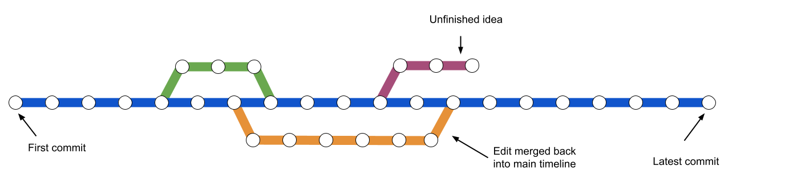
  <figcaption>Branches visualization</figcaption>
</figure>

If an editor, friend or relation reads your chapter and suggests some changes,
you can easily merge those changes back into your main timeline, even if you
have made changes since then.

You can now effortlessly give your book chapters to others to read, then import
their changes back into your system.

<figure>
  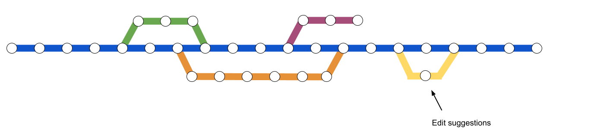
  <figcaption>Branch with edits</figcaption>
</figure>

<span class="software"> In the software development world, you could even share the whole working directory with collaborators. This would allow them to see the entire history of the code base, perhaps giving them insight into how and why you chose to code functionality in a certain way. You could even host the working directory on an accessible server so collaborators can pull the most recent version of the code from the server to their computer. When they are done making changes, they can push their code back to the server.</span>

<button class="next">

[Next: Git Compared](git-compared.md)

</button>
