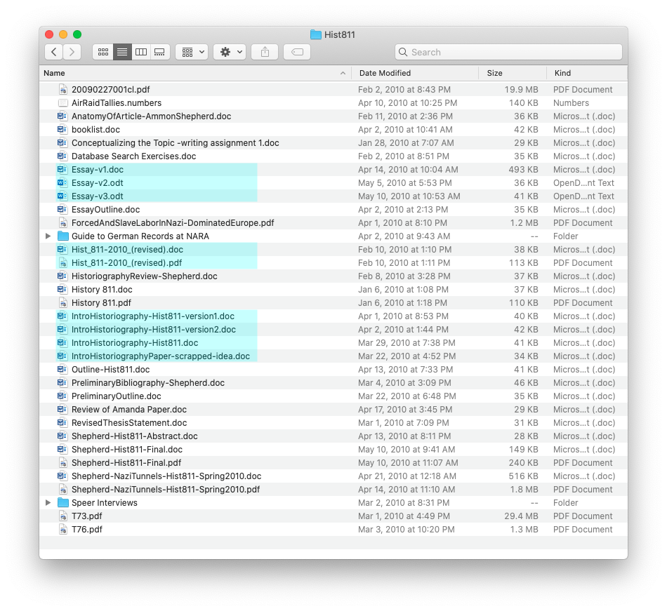

# Introduction

Git can be scary. I get it. It took me years before I actually used Git. I
worked as a systems administrator and ran web servers. We had many developers
programming websites and applications; and they all used Git. I would pretend I
knew how to use it, but I never had. I was scared I would mess things up, ruin
the code, or delete everything and look like a fool. But this is exactly what
Git was built to take care of. Fortunately, I forced myself to learn it through
reading through lots of articles, books, documentation, support websites, and
playing around with Git for personal projects. There are definitely ways to
obliterate your work, but if you learn the why and the how, you can use Git
safely. Just like driving a car. ;)

## Why do you need Git?

Creating content can be messy. Naming files with dates, keeping track of
different versions of files, keeping copies of everything “just in case”. This
was especially true for me while I was in graduate school studying history. I
had files with names that reflected who had reviewed the file, dates of major
revisions, and files with names like “paper-final”, “paper-final-for-reals”,
“paper-last-final”. My files were a mess.

Now imagine writing a paper or coding a program in collaboration with other
people. How in the world would you keep all those changes and files in a
manageable workflow? That’s where a version control system, like Git, comes in
very handy. But Git is really a content management system that happens to be
really good at tracking versions. Most version control softwares before Git
would keep track of the changes in each file. Git does it a bit differently.
Git takes snapshots of your entire working directory whenever you want,
effectively capturing all your work at any given point.

> Git takes snapshots of your working directory whenever you want.

## The Theory behind Git

This introduction to Git takes a different approach than most. Instead of just
showing you a bunch of different commands to enter into your command line
terminal, this tutorial shows you how you would do things without Git, by hand.
This process makes the reason for the commands and the workflow very clear.
Others have done this before, but their analogies dive too deep for the
beginner. (See here for the inspiration for this tutorial and my personal path
to Git enlightenment :)
[https://matthew-brett.github.io/curious-git/curious_journey.html](https://matthew-brett.github.io/curious-git/curious_journey.html),
and
[http://practical-neuroimaging.github.io/git_parable.html](http://practical-neuroimaging.github.io/git_parable.html)
) This introduction is meant for the beginner to Git. If you’ve never used Git
before, this will help you understand how and why it works, and then give you
the few commands you’ll need in your daily workflow.

You’re going to build the functionality of Git by hand, as if you were writing
a book. This has the benefit of showing how Git can work with non-software
coding scenarios, and shows the steps and logic behind why Git works the way it
does. You can easily imagine writing software instead, and I’ll throw in some
coding examples here and there. This portion of the tutorial should be read
only. You shouldn’t (or don’t need to) follow the steps here. They are just for
illustration and explanation. You won’t really want to do it this way; you’ll
want to just use Git. The second part of this tutorial will walk you through
the steps to use Git in a simple daily workflow, either by yourself or working
with others.

<button class="next">

[NEXT: A Git Analogy](analogy.md)

</button>
