## GitHub and VS Code

This tutorial will guide you through connecting VS Code to your GitHub account.

The ability to use Git is built into VS Code. There is no plug-in
or extension needed to use VS Code with Git or with GitHub.

## Set up remote Git repo

The first step is to open a new VS Code window with File->New Window.

Notice the Git icon on the left sidebar. Click on that.

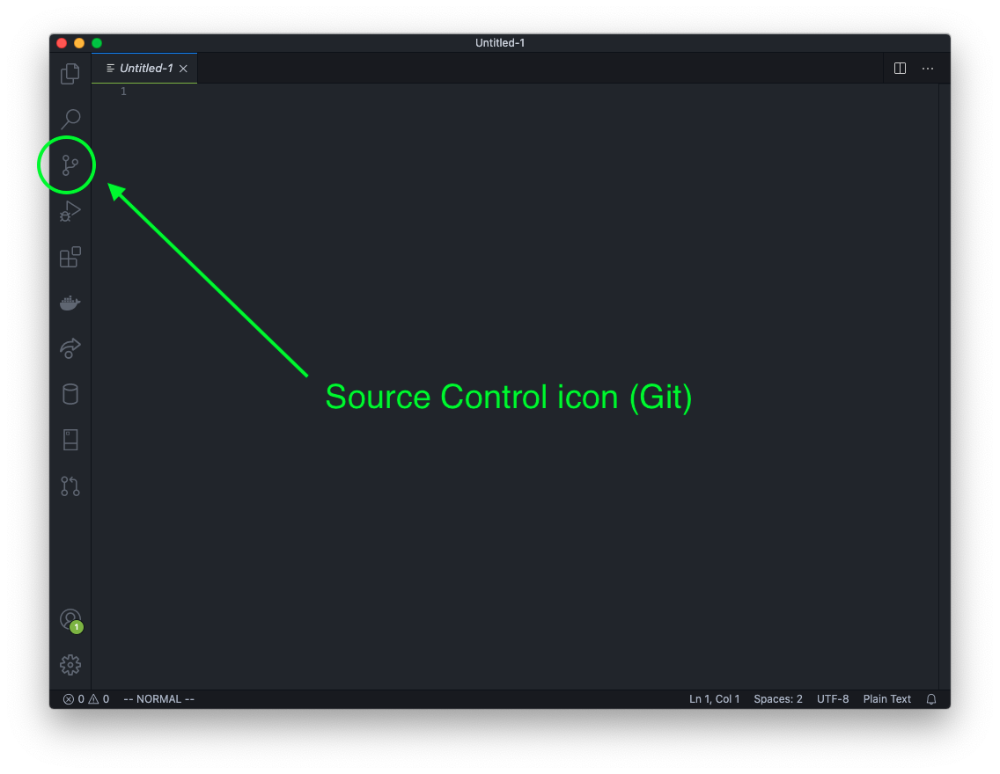

You should see two salmon colored buttons; one for Open Folder and one for Clone
Repository. Click on the Clone Repository button. This opens the VS Code Command
Prompt.

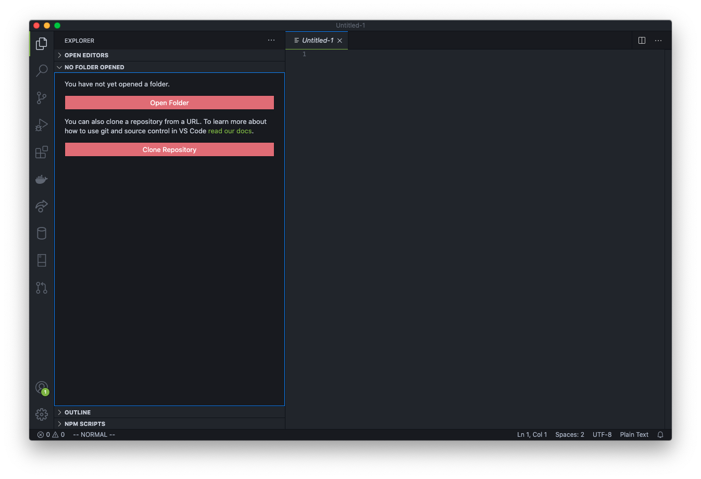

Click on the dropdown option Clone from GitHub.

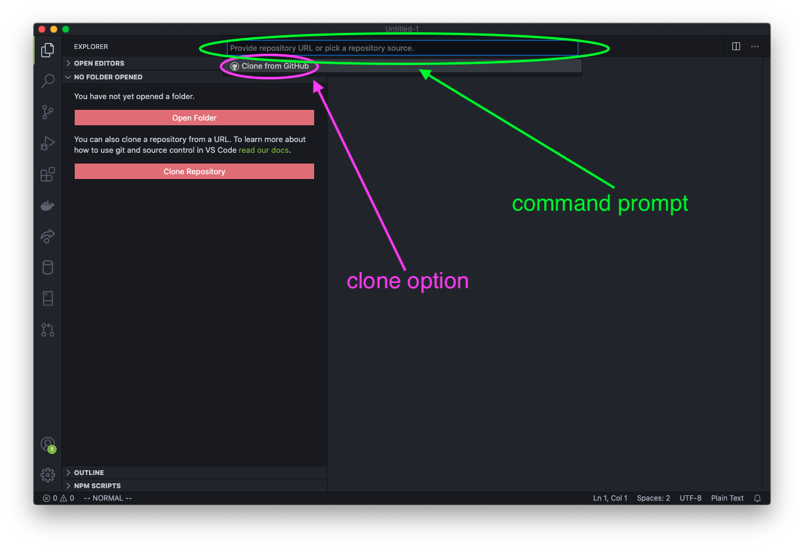

A pop-up will ask if you want to allow the extension to sign in to GitHub. Click
the Allow button.

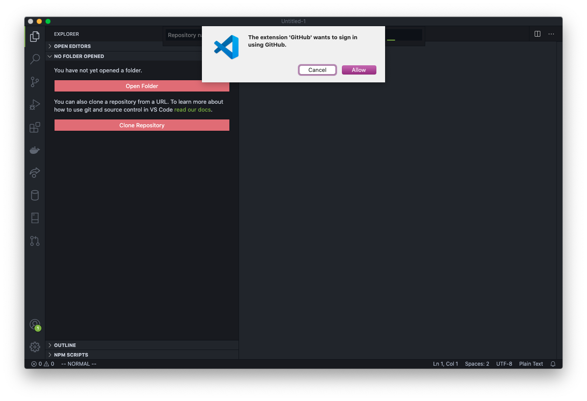

Your browser will then open with a page asking you to continue authorization of
VS Code to access GitHub. Click the big green Continue button.

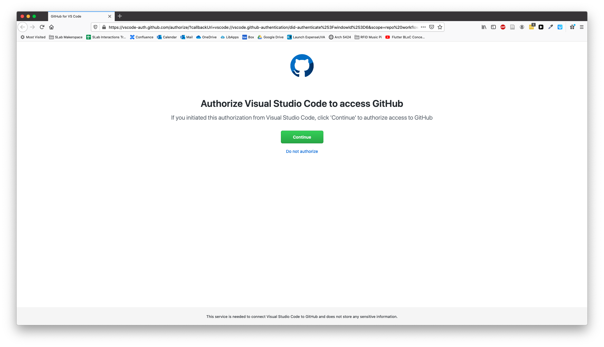

You'll see a success message with an alert box. Click the Open Link button.

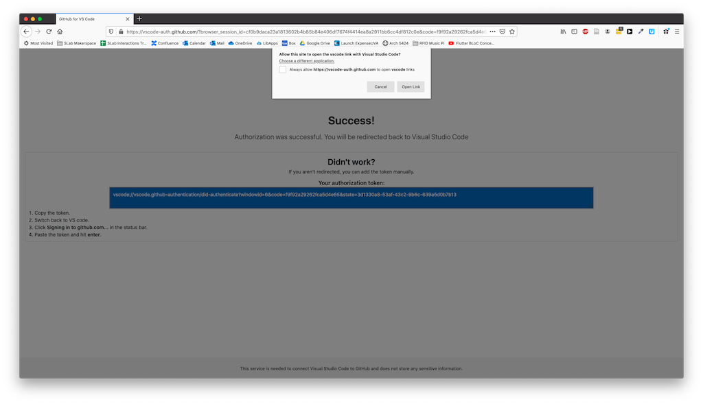

This sends you back to VS Code with a prompt to allow the extension to open the
URI (the address). Click Open.

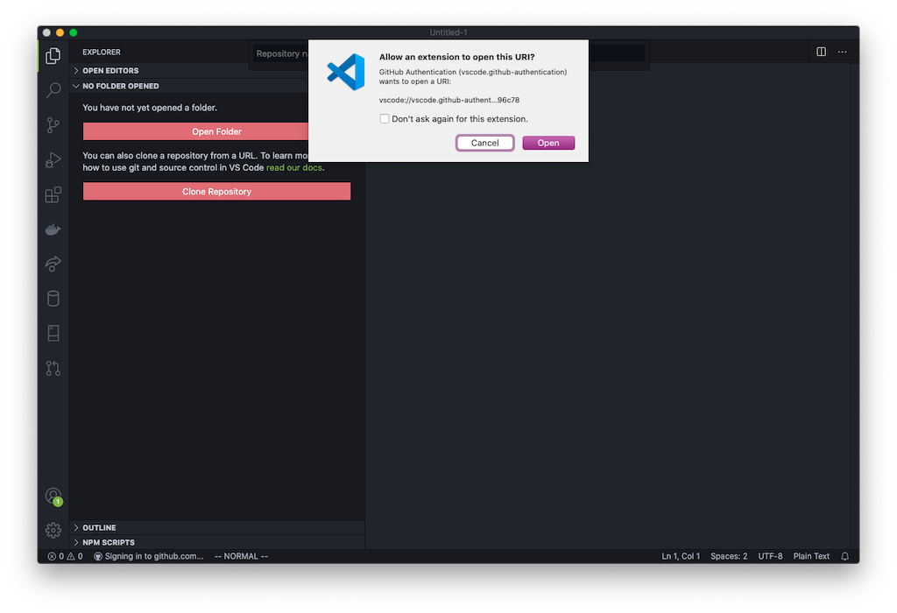

After a second, you will see a drop down with all the repos in your GitHub
account available.

If the repos are not showing as options, then make sure you have authorized VS
Code to access GitHub as done above.

Pick the repo you just created.

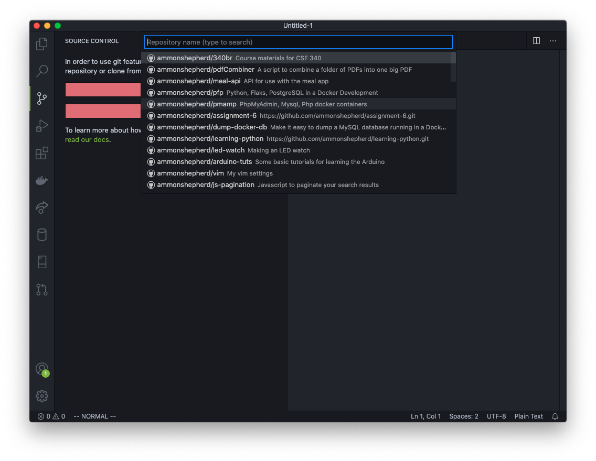

If the repo does not show up, you can type in your GitHub account name followed
by the repo name: username/repo-name Click on that option.

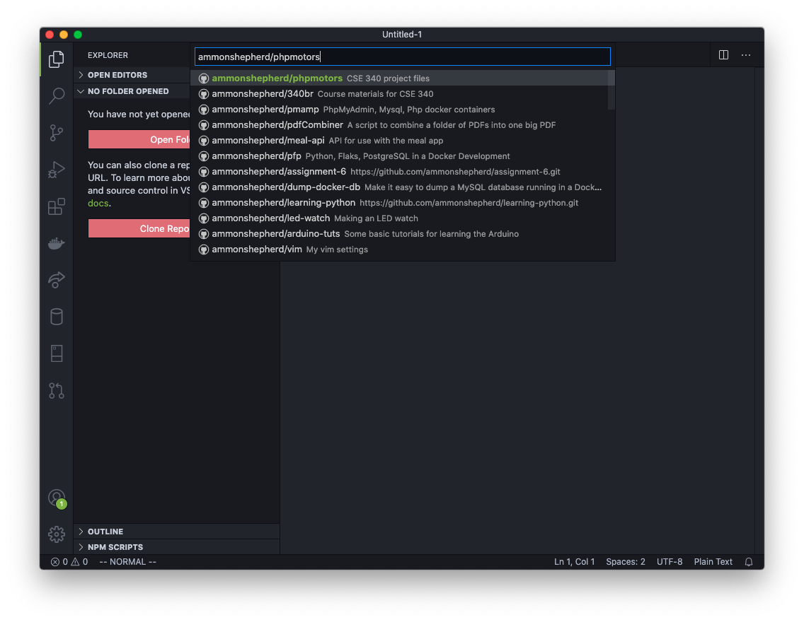

Next, VS Code will ask you to select a location on your computer to put the
files. Browse to your project folder, for example /Documents/cool-website/.

Now select the folder and click the Select Repository Location button.

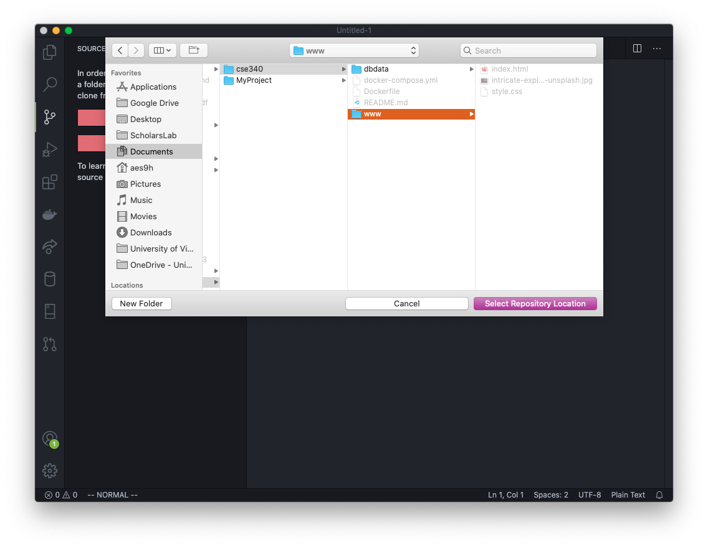

Next click the Open or Open in New Window button on the VS Code notification
pop-up. If the notification disappeared before you could click on it, you can
click the little bell icon to get the notification to reappear.

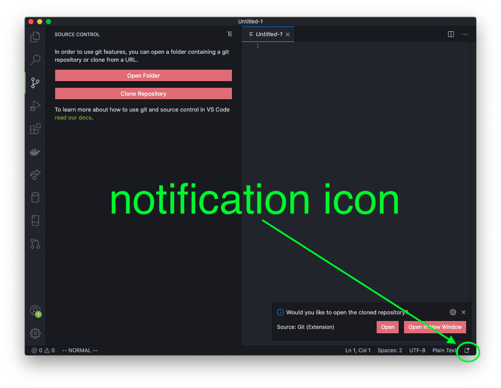

Or you can click on the Open Folder button and browse to the folder you selected
before and select that folder. This is the process for opening this folder from
this point on if the VS Code application is closed.

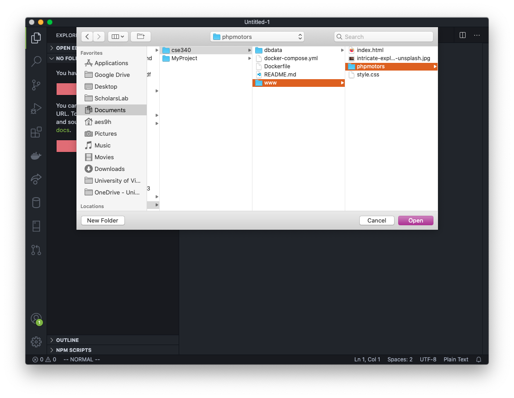

Now VS Code is connected to the GitHub repo and we can start adding files in VS
Code.

<a class="button" href="daily-workflow.html">Next: Daily Workflow</a>

## Troubleshooting Tips

Error: If you try to clone the repository, but it fails to create the
repository folder.

Fix: Try to clone the GitHub repo from the VS Code Terminal. Open VS Code and
open the folder where you have your repository. Open the Terminal (Terminal ->
New Terminal), and type in

<code>git clone https://github.com/YOUR_USER_NAME_HERE/REPONAME.git folder_name</code>

If you get an error like this:

<code>remote: Repository not found. fatal: repository 'https://github.com/MyRepo/project.git/' not found</code>

Then type in

<code>git credential-manager uninstall</code>

followed by

<code>git credential-manager install</code>

Then re-run the git clone command above.