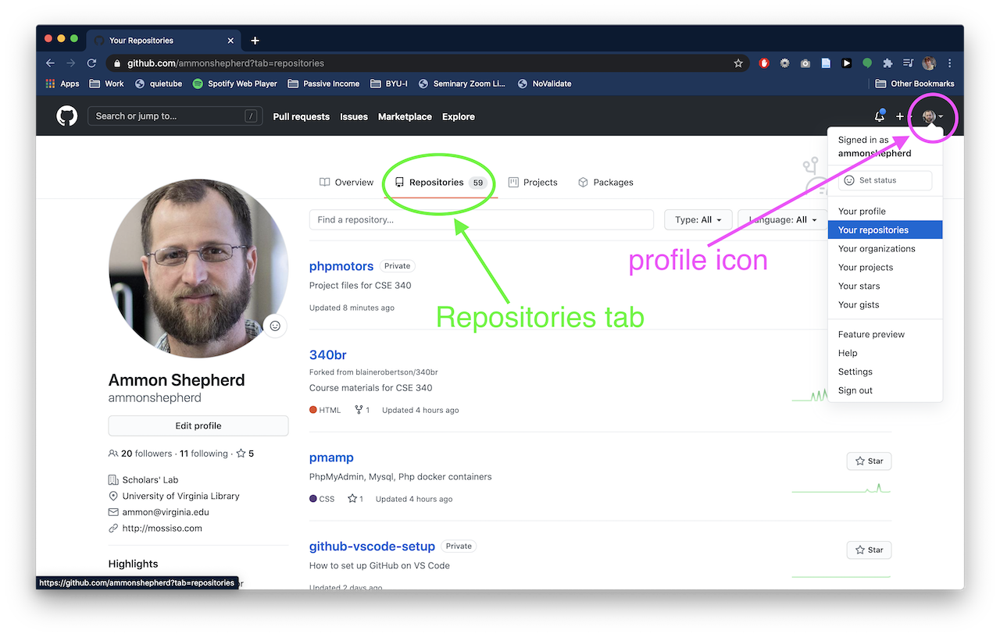
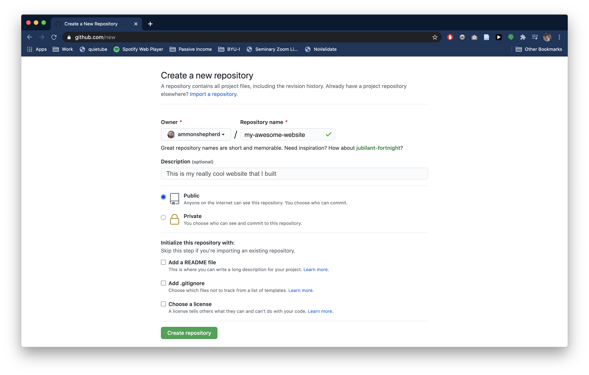
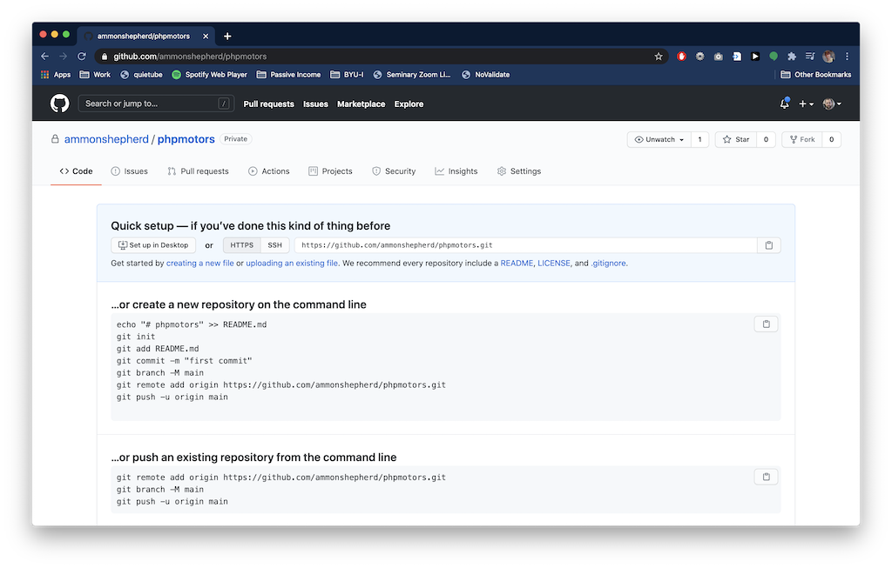
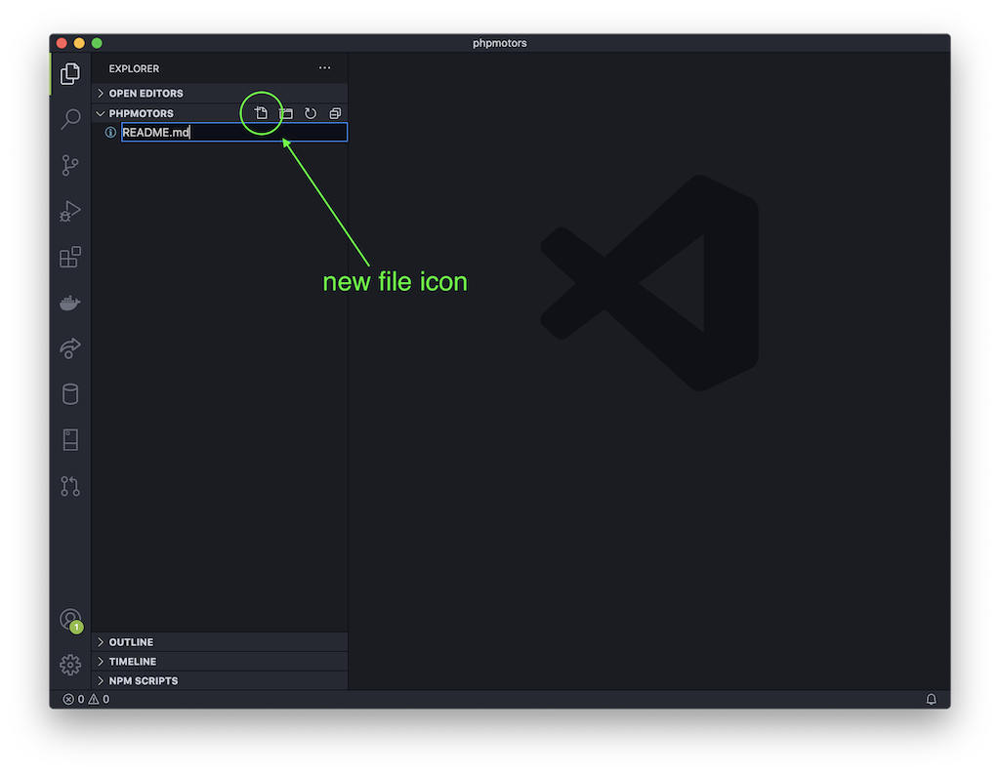
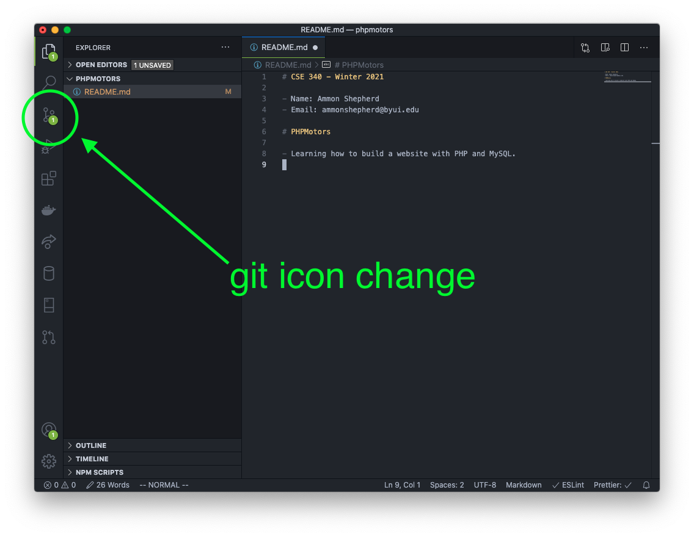
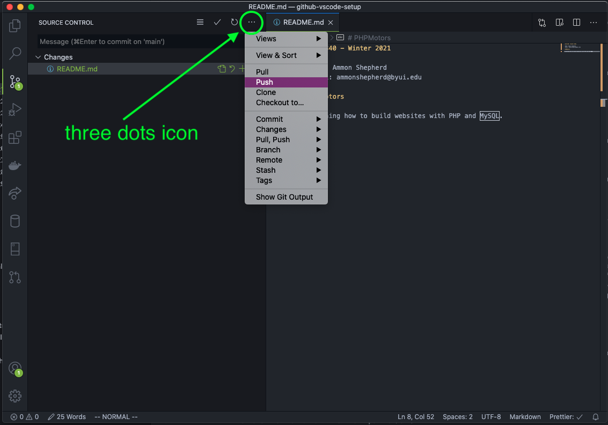

## GitHub and VS Code

This tutorial will guide you through connecting VS Code to your GitHub account.

There are five steps in this tutorial:

- [GitHub and VS Code](#github-and-vs-code)
- [Create a repo](#create-a-repo)
- [GitHub and VS Code](#github-and-vs-code-1)
- [Set up remote Git repo](#set-up-remote-git-repo)
- [Git Workflow](#git-workflow)
- [The README file](#the-readme-file)
- [All set](#all-set)
- [Troubleshooting Tips](#troubleshooting-tips)

GitHub is an online service that hosts your Git repositories. It can also
provide a social aspect to your code. It is used by pretty much all major
software companies. GitHub is not the only service out there, but it is the most
well known. Others include [GitLab](https://about.gitlab.com/),
[Bitbucket](https://bitbucket.org/product), and
[Sourceforge](https://sourceforge.net/)

Using GitHub adds one more step to the normal [Git workflow](daily-workflow.html):

1.  Make changes to your code (edit, add or delete files and folders)
2.  Stage the files and folders you want to commit
3.  Commit the changes
4.  Push the commit to GitHub

## Create a repo

The next step is to create a new repository. A repository is the folder that holds the code. In our case, this is where we will put the code for building the website.



On the GitHub website, after you have logged in,

*   Click on your profile icon on the top right of the page.
*   Click the Your repositories link, then click the green New button.
    *   Alternatively, if you are on the profile page already, click the Repositories tab, then click the green New button.
*   On the New repository page, name the repository anything you like. This will be part of the URL or website address.
*   Fill in a description if you like.
*   Check the "Public" option. Leave the remaining checkboxes empty.
*   Click the green Create repository button.



You are now taken to the repository page for the repository you just created. Do not browse away from this page yet, as we will need a URL from this page later.



## GitHub and VS Code

Open VS Code. You should have done some initial setting up of VS Code already. The ability to use Git is built into VS Code. There is no plug-in or extension needed to use VS Code with Git or with GitHub.

## Set up remote Git repo

The first step is to open a new VS Code window with File->New Window. You can close the other VS Code window. It will not be needed anymore.

Notice the Git icon on the left sidebar. Click on that.


You should see two pink colored buttons; one for Open Folder and one for Clone Repository. Click on the Clone Repository button. This opens the VS Code Command Prompt.


Click on the dropdown option Clone from GitHub.


A pop-up will ask if you want to allow the extension to sign in to GitHub. Click the Allow button.


Your browser will then open with a page asking you to continue authorization of VS Code to access GitHub. Click the big green Continue button.


You'll see a success message with an alert box. Click the Open Link button.


This sends you back to VS Code with a prompt to allow the extension to open the URI (the address). Click Open.


After a second, you will see a drop down with all the repos in your GitHub account available.

If the repos are not showing as options, then make sure you have authorized VS Code to access GitHub as done above.

Pick the repo you just created.


If the repo does not show up, you can type in your GitHub account name followed by the repo name: `username/repo-name` Click on that option.


Next, VS Code will ask you to select a location on your computer to put the files. Browse to your project folder, for example `Documents/cool-website/`.

Now select the folder and click the Select Repository Location button.


Next click the Open or Open in New Window button on the VS Code notification pop-up. If the notification disappeared before you could click on it, you can click the little bell icon to get the notification to reappear.


Or you can click on the Open Folder button and browse to the folder you selected before and select that folder. This is the process for opening this folder from this point on if the VS Code application is closed.


Now VS Code is connected to the GitHub repo and we can start adding files in VS Code.

## Git Workflow

Now is a good time to remind you of the workflow you will be using as you create your website.

Normally, when working with a version control software, you want to work on small discrete chunks of code. After each feature or chunk is complete, you submit that to the version control software as a commit.

Simply stated, the workflow is:

1.  Work on one aspect of the website
2.  Stage and then commit the changes
3.  Work on another aspect of the website
4.  Stage and then commit the changes
5.  Push the changes to your GitHub repo when done making changes

We'll walk through that process by adding a helpful file, called a README file that is used to explain what the repo is all about.

## The README file

Back in VS Code, make a new file by clicking on the new file icon, or go to the File menu and click New File. Name the file `README.md` The `.md` is the file extension for Markdown files. GitHub will know what to do with it.



We'll use Markdown in this file, which is like a distant cousin to HTML. It makes text readable as plain text, but still has some syntax that allows computers to alter the display of the text, just like HTML.

To learn more about the Markdown language, see here: [https://guides.github.com/features/mastering-markdown/](https://guides.github.com/features/mastering-markdown/)

In this new file type in some text to explain what this repository contains:

```     
# My Awesome Website
This is the repository for my really cool website.

You can see the real thing here: 
https://username.github.io/repository-name
```

Save the file.

Now once you save the file, you should notice some things with Git icon on the left side menu. The Git icon now has a number, signifying that it now recognizes that one file has been changed.



If you click on the Git icon, a sidebar opens to display Git info. In this panel, you can stage the changes for a commit, add a message, commit the changes, and even push them to the GitHub repo.


Note: If you discard the changes (the revert icon), then all the changes you made to the file will be lost and the file will revert back to how it was before you made any changes. This is permanent and there is no way to get the changes back.

Before we can make a Git commit, Git needs a name and email to associate with the commit. This will set the name and email in Git's global settings, so you only need to do this once. To do this, open the Terminal in VS Code (Terminal->New Terminal or View->Appearance->Show Panel).

Type in the following command (but use your name) and hit Enter on the keyboard

`git config --global user.name "FIRSTNAME LASTNAME"`

Type in the following command (but use your email address) and hit Enter on the keyboard

`git config --global user.email "youremail@email.com"`


Stage the changes for a commit by pressing the plus icon.

To commit the changes, first type in a short message, then click the check mark or use the short-cut keys (command-Enter on Mac, Ctrl-Enter on Windows).

Once you have committed the changes, you can push the changes to the GitHub repo. Click on the three-dots icon and select Push.



You may be asked if you wish to periodically fetch new changes from GitHub. You don't want this, so select "No".

If you go to the GitHub website in your browser and refresh the page, you should see the README.md file is now listed as a file, and the contents are displayed below.


## All set

You are now all set up with a GitHub repository and your VS Code app is now connected to the repo.

As a reminder, the workflow for updating your website:

1.  Make some edits to the files
2.  Stage and then commit the changes
3.  Push the changes to your GitHub repo
4.  Wait for a few minutes for your changes to appear on your website


<a class="button" href="daily-workflow.html">Next: Daily Workflow</a>

## Troubleshooting Tips

Error: If you try to clone the repository, but it fails to create the `phpmotors` folder...

Fix: Try to clone the GitHub repo from the VS Code Terminal. Open VS Code and open the /Documents/cse340/www/ folder. Open the Terminal (Terminal -> New Terminal), and type in

`git clone https://github.com/YOUR_USER_NAME_HERE/phpmotors.git phpmotors`

If you get an error like this:

remote: Repository not found. fatal: repository 'https://github.com/MyRepo/project.git/' not found

Then type in

`git credential-manager uninstall`

followed by

`git credential-manager install`

Then re-run the git clone command above.