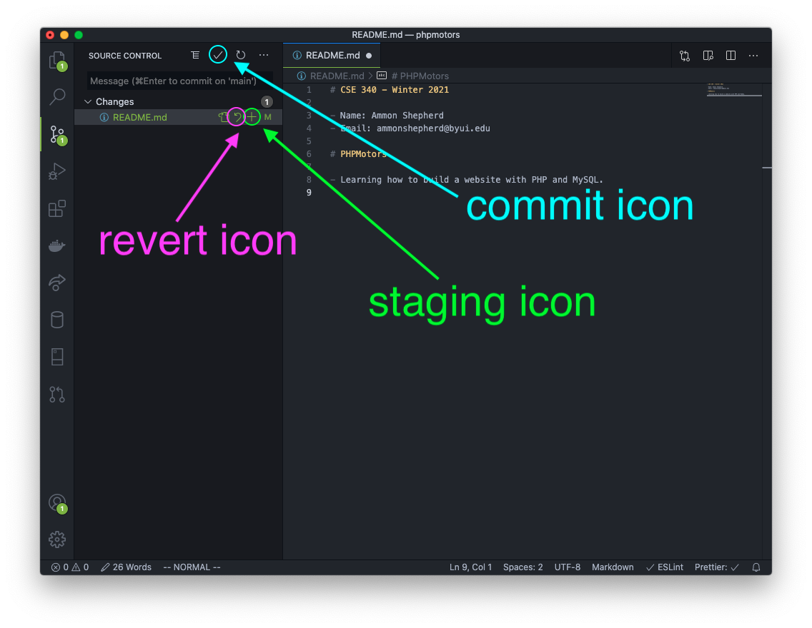
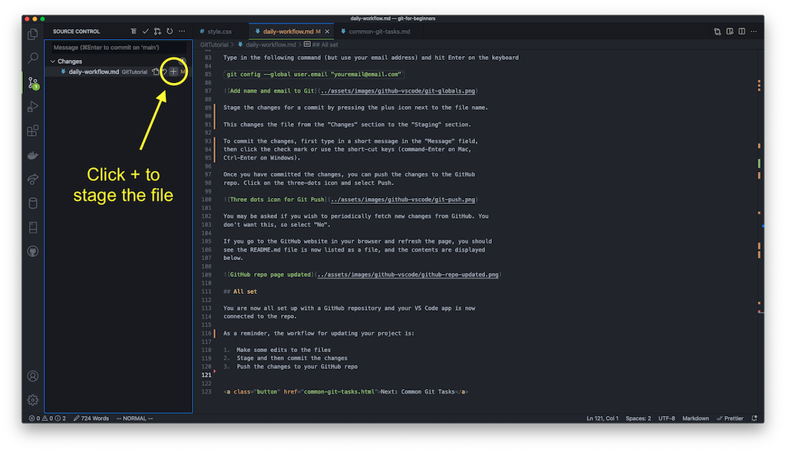
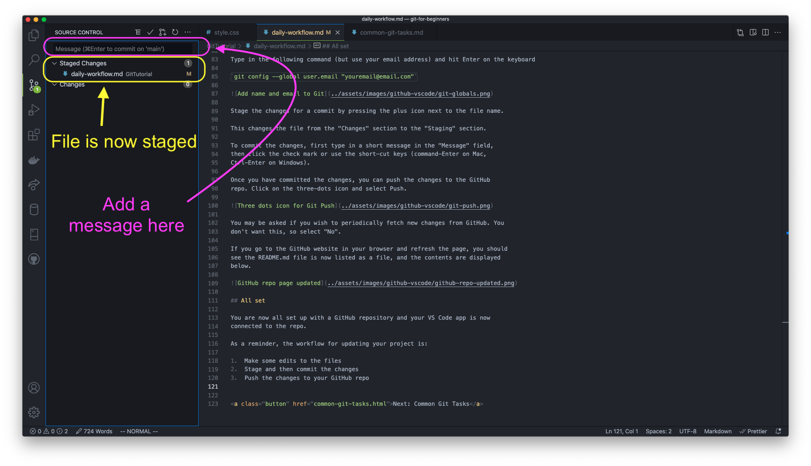
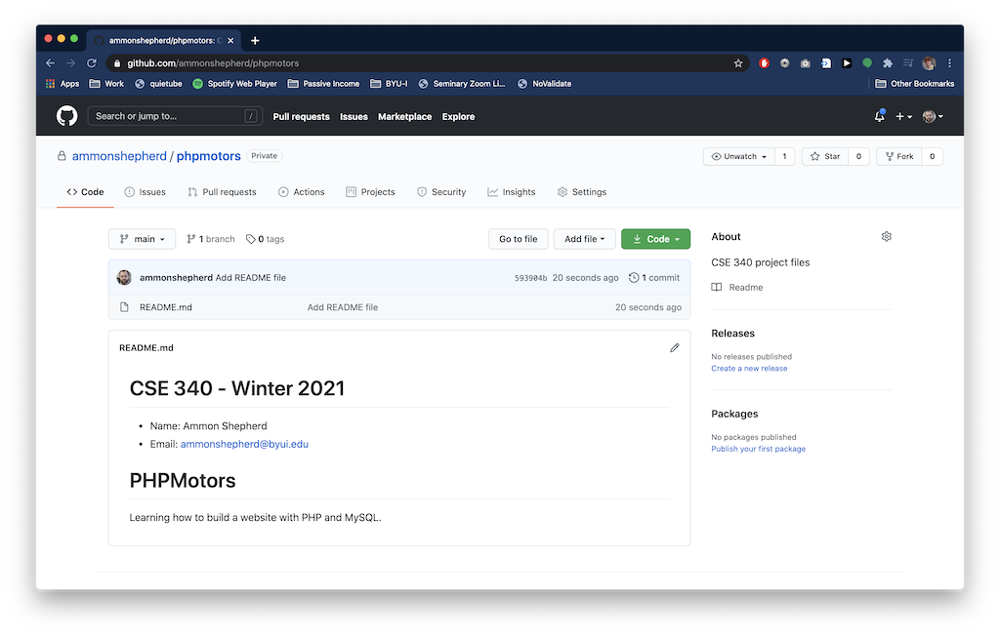

<figure class="top-photo">
  
  <figcaption>
    <a href="https://commons.wikimedia.org/wiki/File:BambooFountain_img_2312.jpg">Dori</a>, <a href="https://creativecommons.org/licenses/by-sa/3.0">CC BY-SA 3.0</a>, via Wikimedia Commons
  </figcaption>
</figure>


## Git Workflow

Normally, when working with a version control software, you want to work on
small discrete chunks of code. After each feature or chunk is complete, you
submit that to the version control software as a commit.

Simply stated, the workflow is:

1.  Work on one aspect of your project
2.  Stage and then commit the changes
3.  Work on another aspect of your project
4.  Stage and then commit the changes
5.  Push the changes to your GitHub repo 

We'll walk through that process by adding a helpful file, called a README file
that is used to explain what the repo is all about.

## The README file

Back in VS Code, make a new file by clicking on the new file icon, or go to the
File menu and click New File. Name the file <span class="terms">README.md</span>
The <span class="terms">.md</span> is the file extension for Markdown files.
GitHub will know what to do with it.


We'll use Markdown in this file, which is like a distant cousin to HTML. It
makes text readable as plain text, but still has some syntax that allows
computers to alter the display of the text, just like HTML.

To learn more about the Markdown language, see here:
[https://guides.github.com/features/mastering-markdown/](https://guides.github.com/features/mastering-markdown/)

In this new file type in some text to explain what this repository contains:


```     
# My Awesome Project
This is the repository for my really cool project.

You can see the real thing here: 
https://username.github.io/repository-name
```

Replace <span class="terms">username.github.io</span> with the domain name from
your repository and <span class="terms">repository-name</span> with the name you
gave your repository.

Save the file.

Now once you save the file, you should notice some things with the Git icon on
the left side menu. The Git icon now has a number, signifying that it now
recognizes that one file has been changed.


If you click on the Git icon, a sidebar opens to display Git info. In this
panel, you can stage the changes for a commit, add a message, commit the
changes, and even push them to the GitHub repo.



Note: If you discard the changes (the revert icon), then all the changes you
made to the file will be lost and the file will revert back to how it was before
you made any changes. This is permanent and there is no way to get the changes
back.

Before we can make a Git commit, Git needs a name and email to associate with
the commit. This will set the name and email in Gits global settings, so you
only need to do this once. To do this, open the Terminal in VS Code
(Terminal->New Terminal or View->Appearance->Show Panel).

Type in the following command (but use your name) and hit Enter on the keyboard

`git config --global user.name "FIRSTNAME LASTNAME"`

Type in the following command (but use your email address) and hit Enter on the keyboard

`git config --global user.email "youremail@email.com"`


Stage the changes for a commit by pressing the plus icon next to the file name.



This changes the file from the "Changes" section to the "Staging" section.

To commit the changes, first type in a short message in the "Message" field,
then click the check mark or use the short-cut keys (command-Enter on Mac,
Ctrl-Enter on Windows).



Once you have committed the changes, you can push the changes to the GitHub
repo. Click on the three-dots icon and select Push.


You may be asked if you wish to periodically fetch new changes from GitHub. You
don't want this, so select "No".

If you go to the GitHub website in your browser and refresh the page, you should
see the README.md file is now listed as a file, and the contents are displayed
below.



## All set

You are now all set up with a GitHub repository and your VS Code app is now
connected to the repo.

As a reminder, the workflow for updating your project is:

1.  Make some edits to the files
2.  Stage and then commit the changes
3.  Push the changes to your GitHub repo


<a class="button" href="common-git-tasks.html">Next: Common Git Tasks</a>