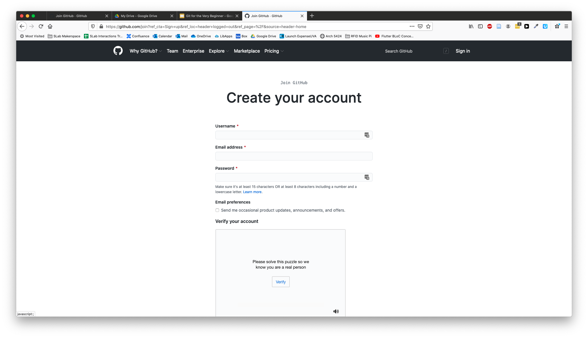
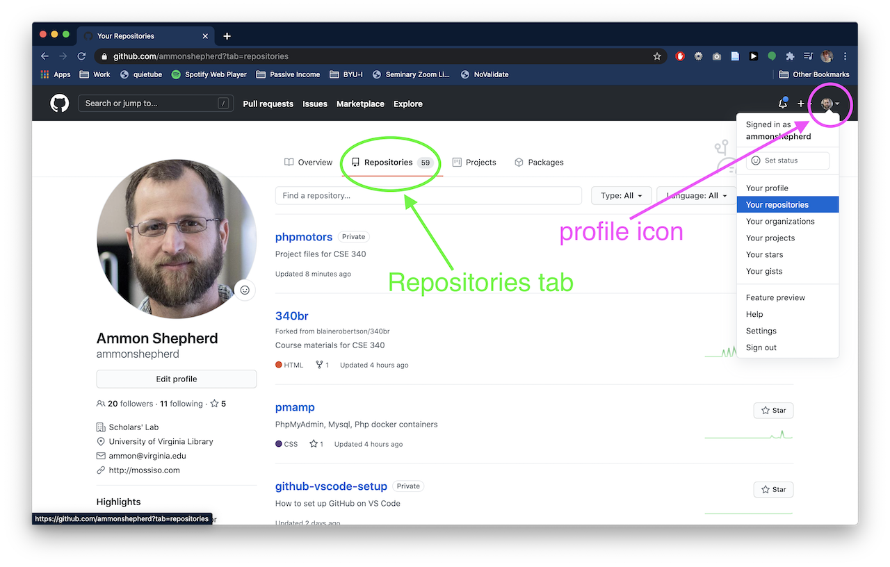
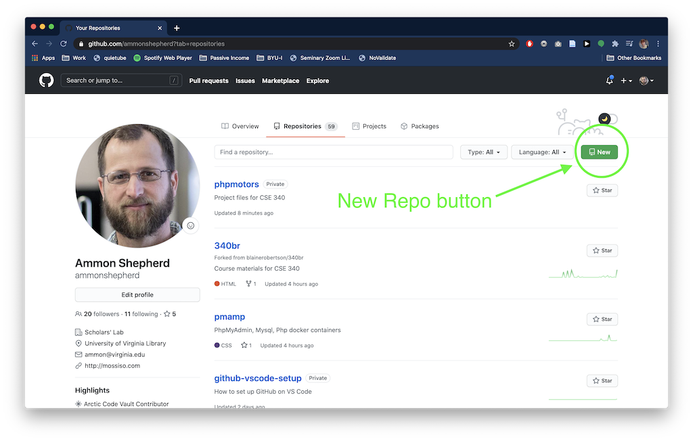
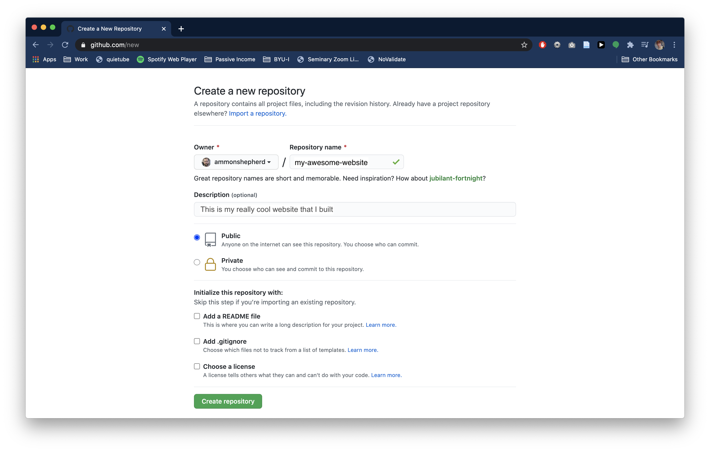
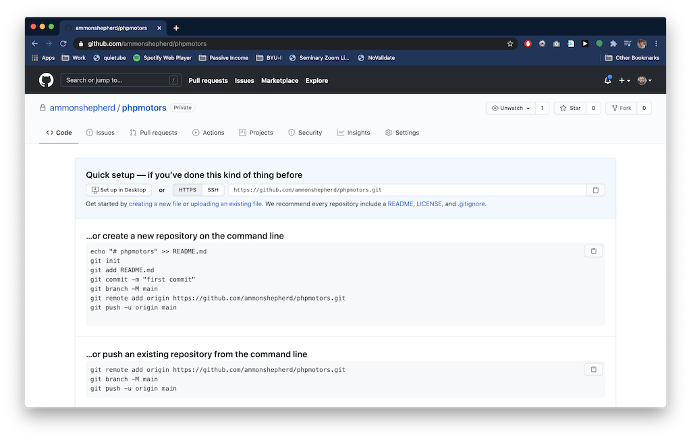

Part 2

<figure class="top-photo">
  
  <figcaption><a href="https://commons.wikimedia.org/wiki/File:MET_LC-91_1_966-002.jpg">Metropolitan Museum of Art</a>, CC0, via Wikimedia Commons</figcaption>
</figure>

## Git Programs

Now that you have learned the why of Git, you can learn the how. Git was
originally created as a command line program, and is generally used in this way.
There are many other programs that interface with Git and provide a graphical
interface. There’s no right or wrong way to use Git and no right or wrong
application to use with Git. It’s simply a tool that you can use to solve a
problem any way you want. This next section will show you how to use a popular
text editor to create files and use Git along with a popular code sharing
website, GitHub.com.

## Installing Git

The steps and URLs for installing Git will change over time. For that reason,
this section will not give exact steps for installing Git. Instead, the best
option is to browse to the official Git website, [http://git-scm.com/](http://git-scm.com/) (at time of
writing) and find the section for downloading and installing Git for your
operating system. Alternatively, do a web or video search for installing Git on
your operating system.

Git is not the only distributed version control software out there. Others
include BitKeeper (the inspiration for Git), Mercurial, Bazaar, Fossil, and
Apache Subversion.

## Installing VS Code

Just as with Git, the steps for downloading and installing VS Code will change.
Browse to the official VS Code website [https://code.visualstudio.com/](https://code.visualstudio.com/) and
follow instructions there for downloading and installing VS Code for your
operating system. Alternatively, do a web or video search for installing VS Code
on your operating system.

There are a very great many applications that help you use Git. VS Code is by no
means the only or the best. It is simply a tool that I find very useful and easy
to use for working with Git and GitHub. Your mileage may vary, and feel free to
adapt these instructions to your favorite code editor or graphical Git
application.

## Using GitHub.com

Using GitHub.com is not required. As a matter of fact, you don’t need to use any
code sharing website at all. If you do want others to see your code and
collaborate with you, then a service like GitHub.com or GitLab.com are great
ways to do so. You can also create a repository on these services that is
private; not publicly visible. You can give other GitHub.com accounts access to
these private repositories to allow collaboration between you and just those
others you allow.

As with installing Git and VS Code, the process may change, so pull up
[https://github.com/](https://github.com/) in a browser and find the button or link to “Sign Up” or
create a new account. The basic steps are:

- Visit [https://github.com](https://github.com) in a browser.
- Click the Sign up button.
- Fill in the required fields for a unique username, email and password. You can uncheck the spam box – er, I mean Email preferences checkbox.
- Complete the "puzzle" by clicking the Verify button, then selecting the right images.
- Finally, click the big blue Create account button.

You will need to verify your email address before you can create a new repository. Check your email for the verify link.

GitHub is an online service that hosts your Git repositories. It can also
provide a social aspect to your code. It is used by pretty much all major
software companies. GitHub is not the only service out there, but it is the most
well known. Others include [GitLab](https://about.gitlab.com/),
[Bitbucket](https://bitbucket.org/product), and
[Sourceforge](https://sourceforge.net/)

Using GitHub adds one more step to the normal [Git workflow](daily-workflow.html):

1.  Make changes to your code (edit, add or delete files and folders)
2.  Stage the files and folders you want to commit
3.  Commit the changes
4.  Push the commit to GitHub

## Create a repo

The next step is to create a new repository. A repository is the folder that
holds the code. In our case, this is where we will put the code for building the
website.

On the GitHub website, after you have logged in,

- Click on your profile icon on the top right of the page.
- Click the Your repositories link, then click the green New button.
    - Alternatively, if you are on the profile page already, click the Repositories tab, then click the green New button.
      
- On the New repository page, name the repository anything you like. This will be part of the URL or website address.
- Fill in a description if you like.
- Check the "Public" option. Leave the remaining checkboxes empty.
- Click the green Create repository button.

You are now taken to the repository page for the repository you just created.

<a class="button" href="vscode-github.html">Next: VS Code and GitHub</a>
